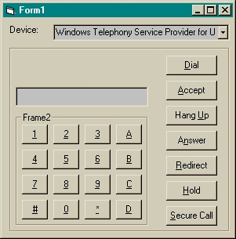



## Low Level TAPI

### Description

For accessing and programming a TAPI line device, like a Modem.
 
### More Info
 
TAPI

             |
---                |---
**Submitted On**   |2002-07-29 15:13:36
**By**             |[Brian Yule](https://github.com/Planet-Source-Code/PSCIndex/blob/master/ByAuthor/brian-yule.md)
**Level**          |Advanced
**User Rating**    |4.9 (54 globes from 11 users)
**Compatibility**  |VB 6\.0
**Category**       |[OLE/ COM/ DCOM/ Active\-X](https://github.com/Planet-Source-Code/PSCIndex/blob/master/ByCategory/ole-com-dcom-active-x__1-29.md)
**World**          |[Visual Basic](https://github.com/Planet-Source-Code/PSCIndex/blob/master/ByWorld/visual-basic.md)
**Archive File**   |[Low\_Level\_1125597302002\.zip](https://github.com/Planet-Source-Code/brian-yule-low-level-tapi__1-37398/archive/master.zip)

